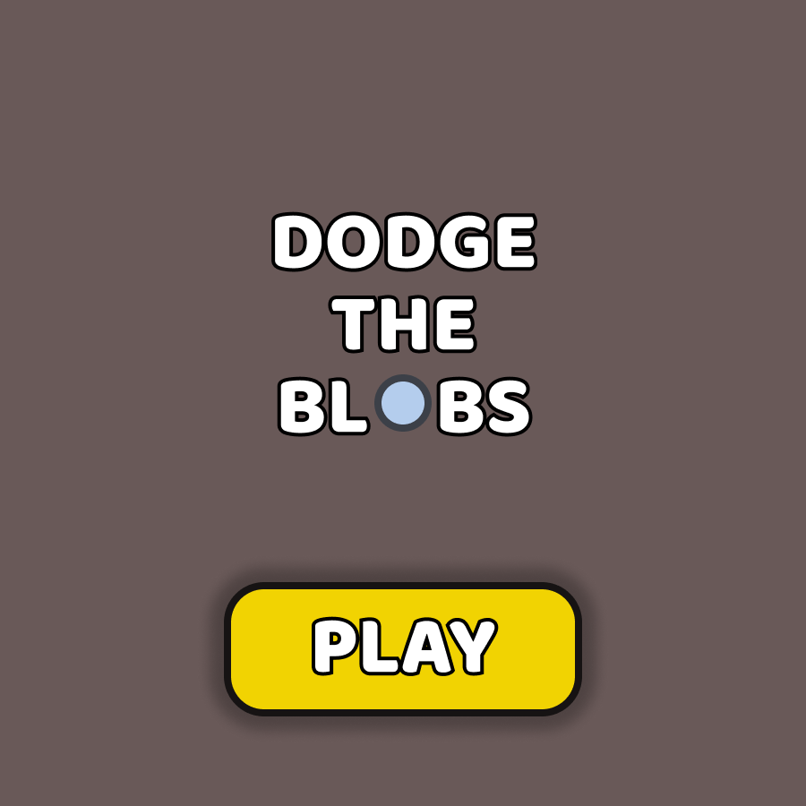
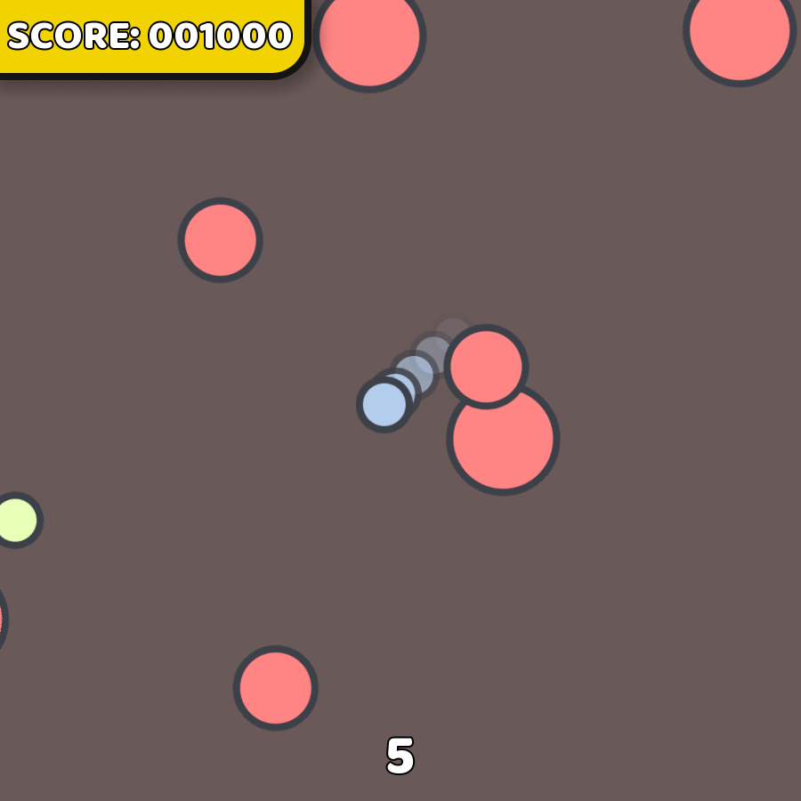
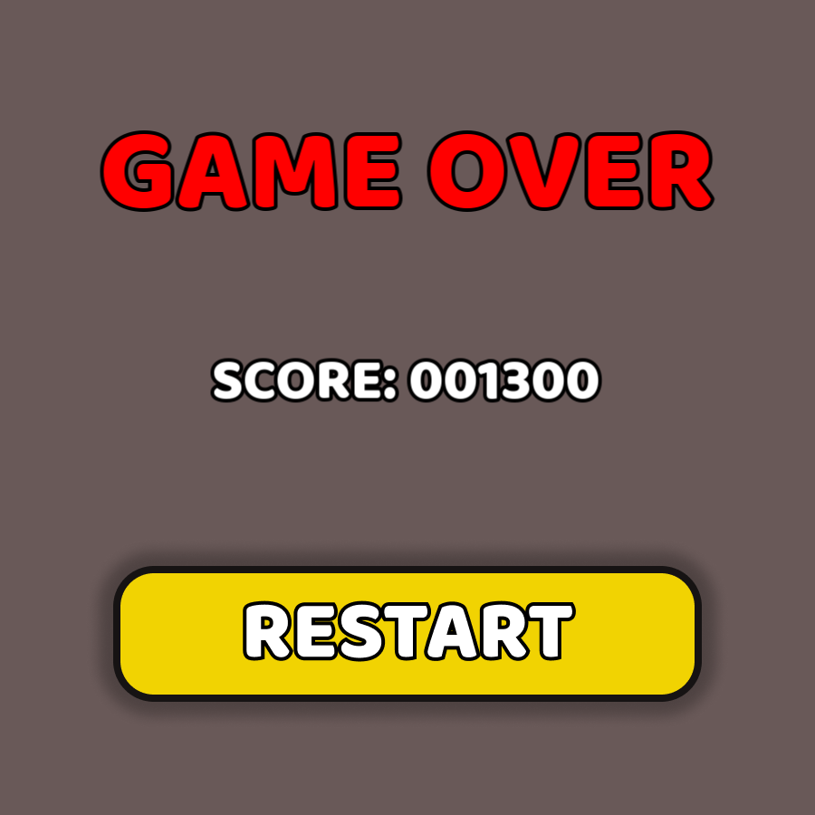

# Dodge the blobs
Small game created as a project for a university course. It is the first programming project issued to me at my university.

 <div align="left">
   
   
   
 </div>

# Getting started
To get started with this project you can download the compiled version for windows [here](https://github.com/m1zukash1/Dodge-the-blobs/releases)<br>
or compile it from source

#### Controls
WASD or arrow keys - Move <br>
Shift or Space - Dash


# Prerequisites
SFML 2.5.1

# Compiling
```
g++ main.cpp -l sfml-system -l sfml-graphics -l sfml-window -o Dodge-the-blobs
```

# Note
I collaborated with three colleagues on this project, but it should be noted that I contributed the majority of the work. My teammates were newcomers to programming and were unfamiliar with using a game development framework. Despite these challenges, our project was awarded the highest possible evaluation and was recognized as the best in our group.
