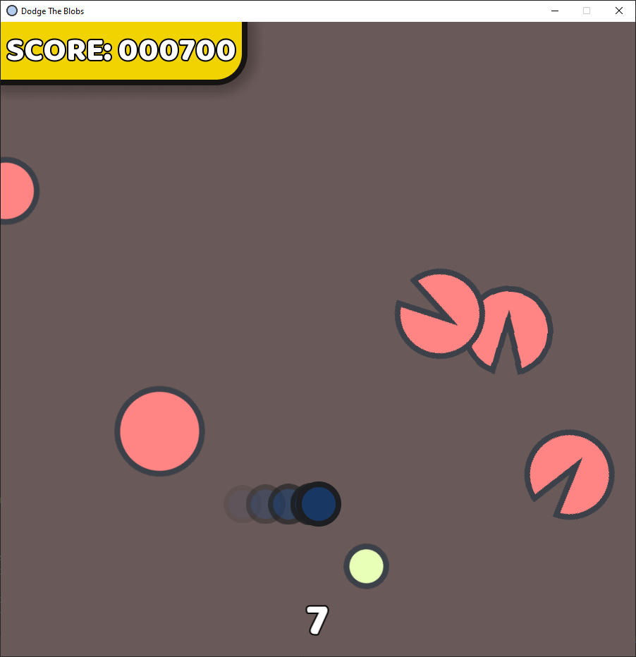

# Dodge the blobs
A small game me and my groupmate made for our university assignment

## Dependencies
SFML 2.5.1
```
sudo apt install libsfml-dev
```

## Compiling on linux
```
g++ main.cpp -l sfml-system -l sfml-graphics -l sfml-window -o Dodge-the-blobs
```

## Controls
WASD or arrow keys - Move <br>
Shift or Space - Dash

## Screenshots




